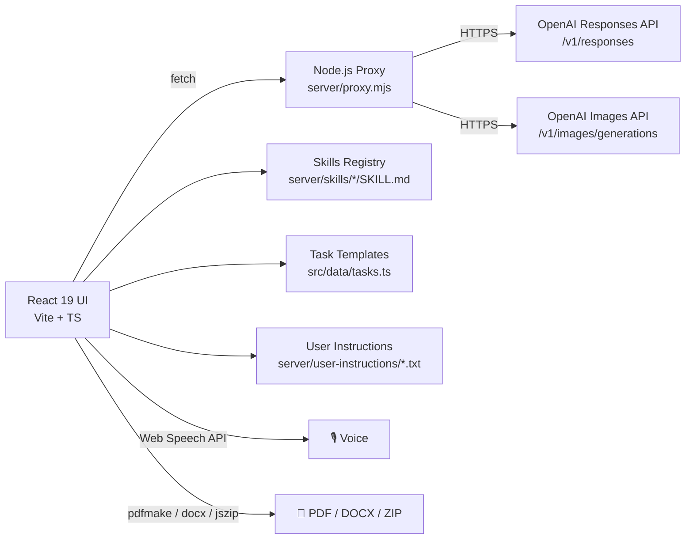

# 🤖 Web ChatGPT

> Giao diện trợ lý AI cho **học tập và công việc** — chạy được ngay ở chế độ demo, sẵn sàng nối OpenAI Responses API khi cần. Có sẵn **10 specialized skills** (dịch thuật, soạn CV, viết email, ghi biên bản…), **export PDF/DOCX/ZIP**, **voice input**, và **image generation với fallback model**.

[](https://react.dev)
[](https://www.typescriptlang.org)
[](https://vitejs.dev)
[](https://nodejs.org)
[](https://openai.com)
[](#-triển-khai-production)
[](LICENSE)

---

## 📸 Demo

> Thêm screenshot vào `docs/screenshots/` rồi cập nhật link bên dưới.

```markdown


```

🌐 **Live demo**: chạy `npm run dev` → mở `http://localhost:5173` (hoạt động ngay với mock responses).

---

## ✨ Tính năng chính

| Module | Mô tả |
|---|---|
| 💬 **Chat nâng cao** | Streaming response, **cancel** & **edit** message, copy, regenerate. Markdown + GFM rendering. |
| 🧩 **10 Skills chuyên biệt** | Translator, Proofreader, Email drafter, Resume generator, Meeting notes, Presentation, Spreadsheet formula, v.v. — chọn 1 click. |
| 📎 **File upload** | Đính kèm PDF / DOCX / TXT — proxy tự đọc và đưa vào context. |
| 🖼️ **Image generation** | Gọi `gpt-image-2`, **tự fallback** `gpt-image-1.5` nếu model không khả dụng. |
| 📄 **Document export** | Xuất PDF (`pdfmake`), DOCX (`docx`), hoặc ZIP nhiều file (`jszip`). |
| 🎙️ **Voice input** | SpeechRecognition API — bấm mic để nói, auto-fill vào ô nhập. |
| 🧠 **User instructions** | Đọc file `server/user-instructions/*.txt` để ép style/tone cá nhân. |
| 📋 **Task templates** | Sẵn 12+ template phổ biến (giải bài, dịch, tóm tắt, v.v.) trong `src/data/tasks.ts`. |
| 🎨 **Theme sáng/tối** | Light/dark mode, responsive desktop & mobile. |
| 🔌 **Mock mode** | Chạy được **không cần API key** — tự trả demo response. |
| 🚀 **Deploy 1-click** | Sẵn config cho Vercel + Render. |

---

## 🏗️ Kiến trúc



**Luồng chính**:
1. User gõ/nói → React UI parse + thêm file attachment.
2. UI gọi adapter `src/lib/openaiClient.ts` → fetch `/api/openai/responses` (Vercel/Render) hoặc `localhost:3001` (dev).
3. Proxy đọc `OPENAI_API_KEY` từ `.env` (server-side, **không bao giờ lộ ra browser**).
4. Forward lên OpenAI, stream response về UI.
5. UI render markdown + cho phép export PDF/DOCX/ZIP.

---

## 🚀 Quick start

### Chạy demo (không cần API key)

```bash
npm install
npm run dev
# → http://localhost:5173
```

App sẽ chạy ở **mock mode** với response mẫu. Phù hợp để xem UI hoặc dev frontend.

### Nối OpenAI Responses API

**Bước 1** — Tạo file `.env` ở root repo:

```dotenv
OPENAI_API_KEY=sk-...
OPENAI_API_URL=https://api.openai.com/v1/responses
# Tùy chọn — nếu không set, proxy tự derive từ OPENAI_API_URL
OPENAI_IMAGE_API_URL=https://api.openai.com/v1/images/generations
OPENAI_IMAGE_MODEL=gpt-image-2
OPENAI_IMAGE_FALLBACK_MODEL=gpt-image-1.5
```

**Bước 2** — Tạo file `.env.local` cho frontend (root):

```dotenv
VITE_USE_MOCK_RESPONSES=false
VITE_OPENAI_PROXY_URL=/api/openai/responses
VITE_OPENAI_IMAGE_PROXY_URL=/api/openai/images
```

**Bước 3** — Chạy frontend + proxy ở 2 terminal:

```powershell
# Terminal 1
npm run api      # → proxy localhost:3001

# Terminal 2
npm run dev      # → UI localhost:5173
```

---

## 🧩 10 Skills có sẵn

Trong `server/skills/`, mỗi skill là 1 file `SKILL.md` mô tả prompt + workflow:

| Skill | Use case |
|---|---|
| `prompt-api` | Viết / debug prompt API |
| `content-research-writer` | Bài nghiên cứu, blog chuyên sâu |
| `writing-assistance-apis` | Viết content marketing, landing page |
| `email-draft-polish` | Soạn & polish email chuyên nghiệp |
| `translator-api` | Dịch thuật giữ nguyên tone |
| `proofreader-api` | Sửa lỗi chính tả, ngữ pháp |
| `meeting-notes-and-actions` | Tóm tắt biên bản họp + action items |
| `presentation-skill` | Outline + script cho slide |
| `spreadsheet-formula-helper` | Viết / giải thích công thức Excel/Google Sheets |
| `tailored-resume-generator` | CV theo JD, tối ưu ATS |

**Thêm skill mới**: tạo folder `server/skills/<skill-id>/SKILL.md` → proxy tự load.

---

## 🌍 Triển khai (Production)

### Vercel (frontend + serverless API)

```bash
# vercel.json đã có sẵn
vercel
```

### Render (backend proxy)

```bash
# render.yaml đã có sẵn
# Web Service → Node 18+ → npm run api
```

---

## 📂 Cấu trúc dự án

```text
web-chatgpt/
├── index.html                  # Vite entry
├── vite.config.ts              # Vite config
├── tsconfig.json               # TS strict
├── vercel.json                 # Vercel routing
├── render.yaml                 # Render Web Service
├── package.json
│
├── src/
│   ├── main.tsx                # React entry
│   ├── App.tsx                 # Main UI (56KB)
│   ├── styles.css              # Theme + components (37KB)
│   ├── types.ts                # TypeScript types
│   ├── data/
│   │   ├── models.ts           # OpenAI model list
│   │   ├── tasks.ts            # Task templates
│   │   └── taskSkills.ts       # Task → Skill mapping
│   └── lib/
│       ├── openaiClient.ts     # API adapter
│       ├── skillClient.ts      # Skills loader
│       ├── fileReaders.ts      # PDF/DOCX readers
│       └── documentArtifacts.ts# Export PDF/DOCX/ZIP
│
├── server/
│   ├── proxy.mjs               # OpenAI proxy (11KB)
│   ├── skills/                 # 10 SKILL.md files
│   └── user-instructions/      # Personal prompt customizations
│
├── public/                     # Static assets
└── docs/
    └── screenshots/            # Add your screenshots here
```

---

## 🎨 Tech stack chi tiết

| Layer | Tech |
|---|---|
| **UI Framework** | React 19 + TypeScript 5.8 (strict mode) |
| **Build** | Vite 7 |
| **Icons** | `lucide-react` |
| **Markdown** | `react-markdown` + `remark-gfm` |
| **PDF export** | `pdfmake` + `pdfjs-dist` (read) |
| **DOCX export** | `docx` |
| **Archive** | `jszip` |
| **Backend** | Node.js 18+ (vanilla `http`, không framework) |
| **AI** | OpenAI Responses API + Images API |
| **Voice** | Web Speech API (browser-native) |
| **Deploy** | Vercel + Render (config có sẵn) |

---

## 🐛 Troubleshooting

| Lỗi | Nguyên nhân | Cách xử lý |
|---|---|---|
| UI trả response demo | `VITE_USE_MOCK_RESPONSES=true` hoặc chưa set `.env.local` | Set `VITE_USE_MOCK_RESPONSES=false` |
| Proxy 401 | Sai `OPENAI_API_KEY` | Check key tại [platform.openai.com](https://platform.openai.com/api-keys) |
| Image gen 404 | Model không tồn tại | Đã có fallback `gpt-image-1.5` — check log proxy |
| File upload fail | File > 25MB | `MAX_REQUEST_BODY_BYTES` env hoặc nén file |
| Voice không hoạt động | Browser không hỗ trợ Web Speech API | Dùng Chrome / Edge (Firefox không support) |

---

## 🤝 Đóng góp

Xem [CONTRIBUTING.md](CONTRIBUTING.md).

## 🔒 Bảo mật

Xem [SECURITY.md](SECURITY.md). **Quan trọng**: `OPENAI_API_KEY` chỉ đặt trong `.env` server-side, **không bao giờ** `VITE_*` (vì sẽ lộ ra browser bundle).

## 📝 Changelog

Xem [CHANGELOG.md](CHANGELOG.md).

## 📄 License

MIT — xem [LICENSE](LICENSE).

---

## 💡 Tính năng có thể mở rộng

- [ ] Streaming SSE response
- [ ] Multi-user auth (NextAuth / Clerk)
- [ ] Persistent chat history (PostgreSQL + Prisma)
- [ ] RAG với vector DB (Pinecone / pgvector)
- [ ] Custom skills editor (no-code)
- [ ] WebSocket cho real-time collaboration

Bạn quan tâm tính năng nào, mở issue để thảo luận.
